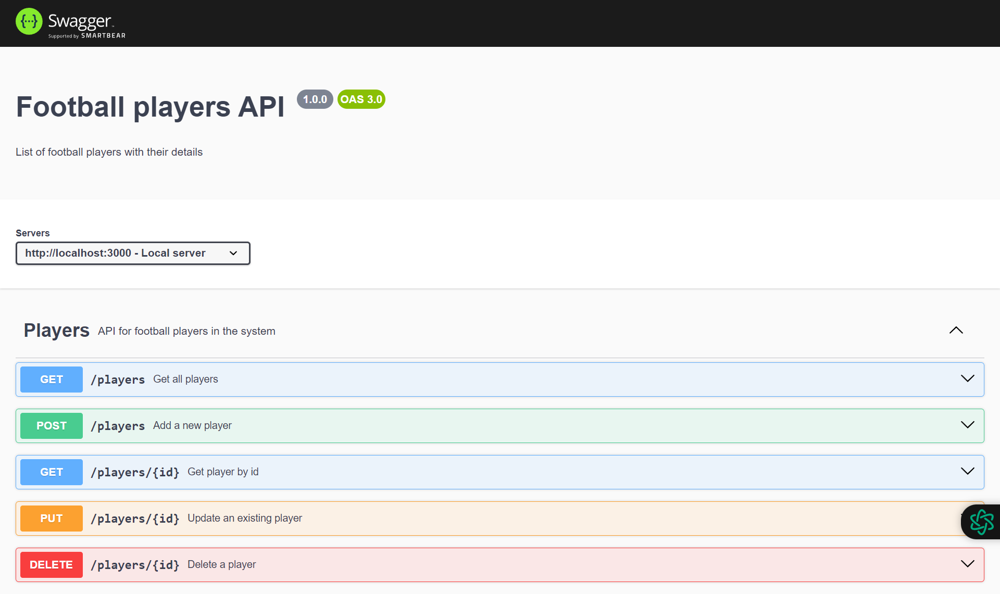

# Football Players API

This project is a RESTful API for managing football players. It allows you to perform CRUD operations on football player data.

## Getting Started

To get started with the project, follow these steps:

1. Clone the repository: `git clone https://github.com/bayuhadi863/football-players-api.git`
2. Install the dependencies: `npm install`
3. Start the server: `node server.js`

The server will start running on `http://localhost:3000`.

## API Endpoints

The following endpoints are available:

- `GET /players`: Get all players
- `GET /players/:id`: Get a specific player by ID
- `POST /players`: Create a new player
- `PUT /players/:id`: Update a player by ID
- `DELETE /players/:id`: Delete a player by ID

## Sending Requests

To send requests to the API, you can use tools like cURL or Postman. 

## View API Documentation

You can also view the API Documentation by visit `http://localhost:3000/api-docs`.

